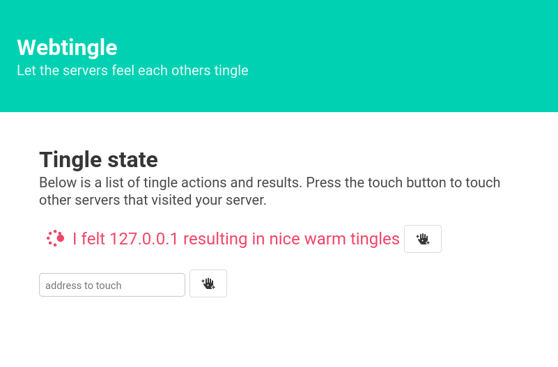

Webtingle: let the servers feel each other
==========================================

Simple web app to HTTP call urls every few seconds and show an access log of calling parties.

Meant to be a demo app for a simple runtime state application where you can check access and firewall rules.

Build status and binary artifact at:

https://app.circleci.com/pipelines/github/bneijt/webtingle?branch=master

Development notes
-----------------

Currently the `index.html` is backed in, so you need to rebuild if you edit that.

    export PORT=8080
    cargo run

Screenshot
----------
